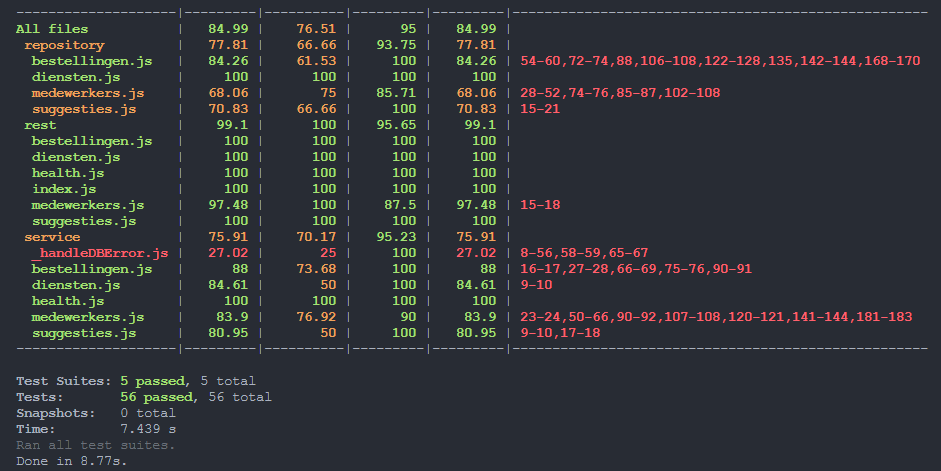

# Brecht Vandekerckhove (201102978)

- [x] Front-end Web Development:
  - https://github.com/Web-IV/2324-frontendweb-BrechtVandekerckhove.git
  - https://web-iv-2324-frontendweb.onrender.com/
- [x] Web Services:
  - https://github.com/Web-IV/2324-webservices-BrechtVandekerckhove.git
  - https://web-iv-2324-webservices.onrender.com

**Logingegevens**

Admin:  
- E-mailadres: admin@hogent.be  
- Wachtwoord: 123admin@

User:  
- E-mailadres: test@hogent.be
- Wachtwoord: 12345678

## Projectbeschrijving

**Naam applicatie**: MidnightMeals

Ziekenhuismedewerkers die 's nachts werken hebben recht op een gratis maaltijd. Via de applicatie MidnightMeals kunnen deze maaltijden besteld worden. Er is keuze tussen een warme maaltijd en een broodmaaltijd.
Bij een warme maaltijd bestaat de keuze een hoofdschotel (3 vaste keuzes + 2 suggesties die maandelijks veranderen), soep of geen soep en zuiveldessert of fruitdessert.
Bij een broodmaaltijd bestaat de keuze uit: bruine of witte sandwiches, 5 keuzes hartig beleg, 5 keuzes zoet beleg, al dan niet vetstof, al dan niet soep, zuivel- of fruitdessert.
Een medewerker kan slechts 1 maaltijd per shift bestellen, leverdatum van een maaltijd moet dus uniek zijn.

**ERD:**  
  

**Mapping:**

**Medewerker** (<ins>id</ins>, naam, voornaam, email, wachtwoord_hash, rollen, dienst)  
IR: vreemde sleutel _dienst_ verwijst naar _id_ uit _Dienst_, is verplicht   
**Bestelling** (<ins>bestellingsnr</ins>, besteldatum, medewerkersId)  
IR: vreemde sleutel _medewerkersId_ verwijst naar _id_ uit _Medewerker_, is verplicht  
**Maaltijd** (<ins>id</ins>, type, leverdatum, leverplaats, hoofdschotel, soep, dessert, typeSandwiches, hartigBeleg, zoetBeleg, vetstof, suggestieVanDeMaandId, bestellingsnr)  
IR: vreemde sleutel _suggestieVanDeMaandId_ verwijst naar _id_ uit _SuggestieVanDeMaand_, is optioneel  
IR: vreemde sleutel _bestellingsnr_ verwijst naar _bestellingsnr_ uit _Bestelling_, is optioneel   
IR: vreemde sleutel leverplaats verwijst naar _id_ uit _Dienst_, is verplicht  
**SuggestieVanDeMaand** (<ins>id</ins>, maand, vegie, omschrijving)  
**Dienst** (<ins>id</ins>, naam)

## Screenshots

  
Login  
  
Registreren  
  
Hoofdpagina  
  
Formulier warme maaltijd  
  
Formulier broodmaaltijd  
  
Datum wordt gedisabled als er reeds een maaltijd is besteld/in winkelmandje zit op die datum
  
Winkelmandje  
  
Bewerken van maaltijd in winkelmandje  
  
Overzicht bestellingen  
  
Zoekfunctie  
  
Mijn profiel  

Page not found  

## API calls

### Bestelling

- Een gebruiker moet al zijn bestellingen kunnen bekijken:  
  `GET /api/bestellingen` 

- Een gebruiker moet zijn bestelling in detail kunnen bekijken:  
  `GET /api/bestellingen/:bestellingsnr` 

- Alle leverdata van alle bestellingen moeten opgevraagd kunnen worden zodat een nieuwe maaltijd niet op eenzelfde leverdatum geplaatst wordt:  
`GET /api/bestellingen/leverdata`

- Een gebruiker moet een winkelmandje kunnen bevestigen, bestelling dus plaatsen:  
  `POST /api/bestellingen` 

- Een gebruiker moet een bestelling kunnen verwijderen:  
  `DELETE /api/bestellingen/:bestellingsnr` 

### SuggestieVanDeMaand
- De suggesties moeten opgevraagd kunnen worden:  
`GET /api/suggesties` 

- De omschrijving van een bepaalde (vegetarische) suggestie van bepaalde maand kan worden opgevraagd (wordt niet gebruikt in de front-end app):  
`GET /api/suggesties?maand=${maand}&vegie={vegie}`

### Dienst
- De diensten kunnen worden opgevraagd:  
`GET /api/diensten`  

### Medewerker 

- Een gebruiker kan zich registreren:  
  `POST /api/medewerkers/register`   

- Een gebruiker kan inloggen:   
  `POST /api/medewerkers/login`   

- Een admin kan alle medewerkers opvragen:   
  `GET /api/medewerkers`   

- Een admin kan een medewerker opvragen, een gebruiker zichzelf:   
  `POST /api/medewerkers/:id`  

- Een admin kan een medewerker aanpassen (ook wachtwoord), een gebruiker zichzelf:   
  `PUT /api/medewerkers/:id`  

- Een admin kan een medewerker verwijderen, een gebruiker zichzelf:   
  `DELETE /api/medewerkers/:id`  

### Test coverage
  

## Behaalde minimumvereisten

### Front-end Web Development

- **componenten**

  - [x] heeft meerdere componenten - dom & slim (naast login/register)
  - [x] applicatie is voldoende complex
  - [ ] definieert constanten (variabelen, functies en componenten) buiten de component
  - [x] minstens één form met meerdere velden met validatie (naast login/register)
  - [x] login systeem
         

- **routing**

  - [x] heeft minstens 2 pagina's (naast login/register)
  - [x] routes worden afgeschermd met authenticatie en autorisatie
         

- **state-management**

  - [x] meerdere API calls (naast login/register)
  - [x] degelijke foutmeldingen indien API-call faalt
  - [x] gebruikt useState enkel voor lokale state
  - [x] gebruikt gepast state management voor globale state - indien van toepassing
         

- **hooks**

  - [x] gebruikt de hooks op de juiste manier
         

- **varia**

  - [x] een aantal niet-triviale e2e testen
  - [x] minstens één extra technologie
  - [x] maakt gebruik van de laatste ES-features (async/await, object destructuring, spread operator...)
  - [x] duidelijke en volledige README.md
  - [x] volledig en tijdig ingediend dossier en voldoende commits

### Web Services

- **datalaag**

  - [x] voldoende complex (meer dan één tabel, 2 een-op-veel of veel-op-veel relaties)
  - [x] één module beheert de connectie + connectie wordt gesloten bij sluiten server (prisma raadt aan om connectie niet expliciet te sluiten)
  - [x] heeft migraties - indien van toepassing
  - [x] heeft seeds
         

- **repositorylaag**

  - [x] definieert één repository per entiteit (niet voor tussentabellen) - indien van toepassing
  - [x] mapt OO-rijke data naar relationele tabellen en vice versa - indien van toepassing
         

- **servicelaag met een zekere complexiteit**

  - [x] bevat alle domeinlogica
  - [x] bevat geen SQL-queries of databank-gerelateerde code
         

- **REST-laag**

  - [x] meerdere routes met invoervalidatie
  - [x] degelijke foutboodschappen
  - [ ] volgt de conventies van een RESTful API
  - [ ] bevat geen domeinlogica
  - [x] geen API calls voor entiteiten die geen zin hebben zonder hun ouder (bvb tussentabellen)
  - [x] degelijke authorisatie/authenticatie op alle routes
         

- **algemeen**

  - [x] er is een minimum aan logging voorzien
  - [x] een aantal niet-triviale integratietesten (min. 1 controller >=80% coverage)
  - [x] minstens één extra technologie 
  - [x] maakt gebruik van de laatste ES-features (async/await, object destructuring, spread operator...)
  - [x] duidelijke en volledige README.md
  - [x] volledig en tijdig ingediend dossier en voldoende commits

## Projectstructuur

### Front-end Web Development

Gelijkaardige structuur als de voorbeeldapplicatie. In de src map bevindt zich bovendien een map data. Daar heb ik de opties voor de selectvelden geplaatst aangezien deze zich niet in de databank bevinden. 

### Web Services

Gelijkaardige structuur als de voorbeeldapplicatie, voor ORM prisma een apparte map voorzien.
## Extra technologie

### Front-end Web Development
- Ant Design library: https://www.npmjs.com/package/antd en https://ant.design/  
Een ui library met vele kant-en-klare oplossingen. Ik heb hier vooral componenten uitgebruikt.  
- Formik(-antd): https://www.npmjs.com/package/formik-antd en https://www.npmjs.com/package/formik  
Een package om eenvoudiger formulieren te maken in React, formik-antd is specifiek om met de antd library te werken.   
- Yup: https://www.npmjs.com/package/yup  
Een hulp om validatieschema's te maken, gebruikt voor de formulieren

### Web Services

- ORM Prisma: https://www.npmjs.com/package/prisma en https://www.prisma.io/  
Het databank ontwerp configureer je via een schema.prisma bestand, queries gebeuren via functies (create, findFirst, findUnqiue, delete, update, ...).  
Migraties zijn eenvoudig uit te voeren na het aanpassen van het schema.prisma bestand in development mode via `yarn prisma migrate dev`.  
Seeden van de database gebeurt via het seed.js bestand en kan via commando `yarn prisma db seed` uitgevoerd worden (wordt ook uitgevoerd bij `yarn prisma migrate dev`).  
De DATABASE_URL wordt opgeslagen als een omgevingsvariable. 
De database wordt online opgebouwd door in render als build command `yarn prisma migrate deploy` mee te geven.

## Testresultaten

### Front-end Web Development
- bestellingOverzicht:
  - bestellingen en maaltijden worden weergeven
  - laadindicator wordt getoond
  - zoekfunctie toont correct maaltijd en naam
  - zoekfunctie toont ook correct meerdere maaltijden en namen
  - zoekfunctie toont niks bij geen match
  - foutboodschap wordt getoond bij fout back-end
- maaltijdBewerkenInWinkelmandje:  
maaltijd toevoegen in winkelmandje, bewerken in winkelmandje, bewerking ok  
- maaltijdToevoegenZonderLeverdatum:  
 maaltijd toevoegen zonder leverdatum: foutboodschap en niet toegevoegd aan winkelmandje  
- maaltijdToevoegenZonderLeverplaats:  
maaltijd toevoegen zonder leverplaats: foutboodschap en niet toegevoegd aan winkelmandje  
- tweeMaaltijdenZelfdeLeverdatumTrachtenSelecteren:  
  twee maaltijden met zelfde leverdatum selecteren is onmogelijk  
- voegBroodMaaltijdToeAanWinkelmandjeEnVerwijder:  
broodmaaltijd correct toegevoegd aan winkelmandje, daarna verwijderen  
- voegWarmeMaaltijdToeAanWinkelmandjeEnVerwijder:  
warme maaltijd correct toegevoegd aan winkelmandje, daarna verwijderen  

### Web Services

#### Bestellingen
- `GET /api/bestellingen`:
  - als gebruiker: alle bestellingen van de gebruiker
  - als admin: alle bestellingen
- `GET /api/bestellingen/:id`:
  - als gebruiker: bestellingen van gebruiker toegelaten, van andere niet => fout
  - als admin: bestelling van iedereen toegelaten
- `POST /api/bestellingen`
- `DELETE /api/bestellingen/:id`:
  - als gebruiker: bestellingen van gebruiker toegelaten, van andere niet => fout
  - als admin: bestelling van iedereen toegelaten
  - enkel bestellingen met enkel maaltijden in de toekomst kunnen worden verwijderd, anders fout.
- `GET /api/bestellingen/leverdata`:
  - zowel admin als gebruiker: leverdata van eigen bestellingen 

#### Diensten  
- `GET /api/diensten`
#### Suggesties  
- `GET /api/suggesties`  
- `GET /api/suggesties?maand=${maand}&vegie={vegie}`:
  - correcte maand en vegie params
  - foute maand param => fout
#### Medewerker  
- `GET /api/medewerkers`:  
  - als gebruiker => fout
  - als admin
- `GET /api/medewerkers/:id`:
  - als gebruiker: zichzelf toegelaten, anderen niet => fout
  - als admin: iedere medewerker toegelaten
- `PUT /api/medewerkers/:id`:
  - als gebruiker: zichzelf toegelaten, anderen niet => fout
  - als admin: iedere medewerker toegelaten
  - paramater te weinig meegeven => fout
- `DELETE /api/medewerkers/:id`:
  - als gebruiker: zichzelf toegelaten, anderen niet => fout
  - als admin: iedere medewerker toegelaten
## Gekende bugs

### Front-end Web Development

- Als je uitlogt en terug inlogt als een andere gebruiker kan je op /bestellingen nog kort de bestellingen zien van de eerste ingelogde gebruiker. 
- Annuleer knoppen op /profiel werken niet steeds direct.

### Web Services

> Zijn er gekende bugs?

